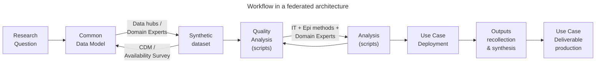
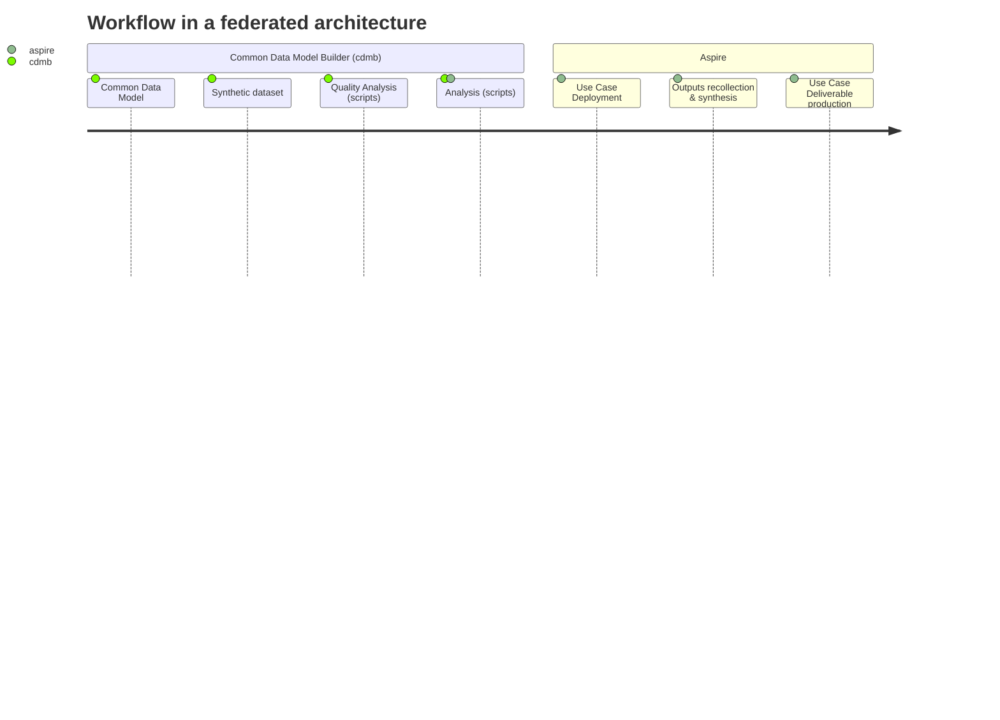
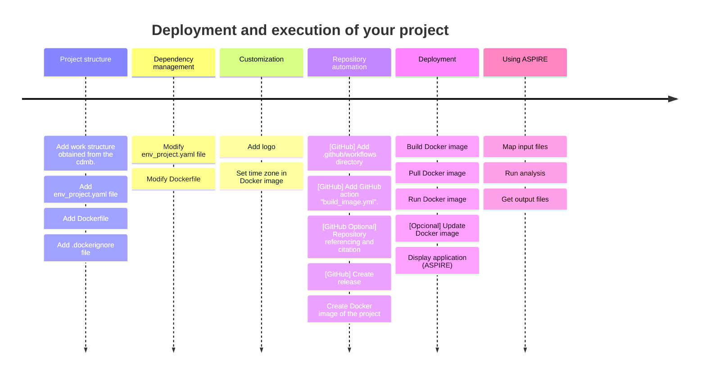

<p align="center">
  
  [:es: Español](#como-desplegar-tu-pipeline-de-análisis-usando-aspire) • [:uk: English](#how-to-deploy-your-analysis-pipeline-using-aspire) 
  
</p>


# Como desplegar los análisis de tu proyecto de investigación usando ASPIRE

Bienvenido al tutorial para aprender a desplegar los análisis de tu proyecto de investigación configurado a partir del uso de la librería Common Data Model Builder ('cdmb') usando ASPIRE (Analytic Software Pipeline Interface for Reproducible Execution). 

En primer lugar, echemos un vistazo a la metodología de trabajo seguida en una arquitectura federada. 


Más información de las herramientas utilizadas:
<p align="left">
<a href="https://github.com/cienciadedatosysalud/aspire"></a>
<a href="https://github.com/cienciadedatosysalud/cdmb"></a>
</p>

Una vez formulada la pregunta de investigación, completa las siguientes tareas antes de empezar el tutorial:

Tareas:

- [ ] 1. Crear el modelo común de datos usando la librería [cdmb](https://github.com/cienciadedatosysalud/cdmb).
- [ ] 2. Implementar los scripts de análisis en R o Python en la estructura de trabajo que se obtiene del [cdmb](https://github.com/cienciadedatosysalud/cdmb).
- [ ] 3. Realizar el testeo adecuado de los scripts con dato sintético.
- [ ] 4. Seguir este tutorial :blush:

Una vez hayas completado los tres primeros pasos podemos empezar con el tutorial.

# Tutorial

 [Estructura del proyecto](#estructura-del-proyecto) • [Gestión de dependencias](#gestión-de-dependencias) • [Personalización](#personalización) • [Automatización del repositorio](#automatización-del-repositorio) • [Despliegue](#despliegue-del-pipeline-de-análisis) • [Como usar ASPIRE](#como-usar-aspire)


## Estructura del proyecto

Para poder empaquetar nuestro pipeline de análisis es necesario partir de una estructura del proyecto estandarizada. En concreto, este tutorial se basa en la integración de la estructura del proyecto del modelo común de datos generada a partir de la utilización de la librería Common Data Model Builder (cdmb) y elementos auxiliares que nos ayudarán a instalar las dependencias necesarias de nuestro código de análisis y el empaquetamiento usando ASPIRE.

Tareas:
- [ ] Añadir el fichero `env_project.yaml`
- [ ] Añadir el fichero `Dockerfile`
- [ ] Añadir el fichero `.dockerignore`


Obteniendo una estructura del proyecto como la siguiente:


> [!TIP]
> Puedes utilizar este repositorio como plantilla en el despliegue de tu pipeline de análisis. Para más información, visite [Crear un repositorio desde una plantilla](https://docs.github.com/es/repositories/creating-and-managing-repositories/creating-a-repository-from-a-template)

> [!IMPORTANT]  
> Revisa tus ficheros `.gitignore` y `.dockerignore`, asegúrate que no se publica ningún dato sensible utilizado en el desarrollo de los análisis en el repositorio de código ni en la imagen Docker.


## Gestión de dependencias

En este apartado trabajaremos los elementos que se encargan de instalar las dependencias (i.e., paquetes y/o librerías) requeridas por tus análisis.

ASPIRE usa [Micromamba](https://mamba.readthedocs.io/en/latest/user_guide/micromamba.html) para la gestión de dependencias de librerías y paquetes. Micromamba es una versión ligera y rápida de Mamba, un gestor de paquetes y entornos para Python y otros lenguajes.

La imagen base de ASPIRE (imagen Docker) tiene instalado por defecto el siguiente conjunto de tecnologías/programas.

- Python
- R
- Quarto
- Librerias/paquetes:
<table>
<tr><td>

| Software  | Librería/paquete |
| ------------- | ------------- |
| Python  | fastapi  |
| Python  | chardet  |
| Python  | starlette  |
| Python  | urllib3  |
| Python  | uvicorn  |
| Python  | ydata-profiling  |
| Python  | python-multipart  |
| Python  | pandas  |
| Python  | duckdb  |
| &nbsp;  |   |
| &nbsp;  |   |
| &nbsp;  |   |
| &nbsp;  |   |
| &nbsp;  |   |

</td><td>

| Software  | Librería/paquete |
| ------------- | ------------- |
| R  | base  |
| R  | knitr  |
| R  | rmarkdown  |
| R  | urllib3  |
| R  | uvicorn  |
| R  | logger  |
| R  | kableextra |
| R  | dbi  |
| R  | dplyr  |
| R  | purrr  |
| R  | remotes  |
| R  | rjson  |
| R  | hmisc  |
| R  | duckdb  |

</td>

</tr> </table>

Todas las dependencias de ASPIRE están instaladas en el entorno (environment) denominado **aspire**. 
Una vez completado el paso anterior es necesario actualizar el entorno **aspire** y añadir las dependencias restantes para poder ejecutar nuestros scripts de análisis. 

Tareas:

- [ ] Modificar el fichero env_project.yaml
- [ ] Modificar el fichero Dockerfile 

> [!TIP]
> Apunta durante el desarrollo del código de análisis todas las librerías/paquetes que has necesitado con sus correspondientes versiones y evita tener en el código declaradas dependencias que no se utilizan.

###  Modificar fichero env_project.yaml

El fichero **env_project.yaml** es un fichero que sigue las especificaciones YAML de Conda.

Los archivos YAML de Conda son archivos que contienen la información necesaria para crear y reproducir un entorno de Conda, como el nombre, los canales, las dependencias y las variables de entorno. 

Los archivos YAML de Conda tienen una estructura simple y legible, donde cada elemento se separa por dos puntos (:) o por guiones (-). 

> [!NOTE]  
> Un canal es una estructura de repositorios independiente y aislada que se utiliza para clasificar y administrar más fácilmente un servidor de paquetes. (más [información](https://mamba.readthedocs.io/en/latest/advanced_usage/more_concepts.html))

Cambia el ejemplo proporcionado por las librerías necesarias para el análisis y disponibles en los canales declarado (channels). Por ejemplo, el siguiente archivo YAML actualiza el entorno llamado aspire usando el canal [conda-forge](https://conda-forge.org/) con pandas versión 2.1.0, el paquete plotly de R versión 4.10.2, etc. 


``` yaml
name: aspire
channels:
 - conda-forge
dependencies:
- r-sf=1.0_14
- r-sjmisc=2.8.9
- r-gt=0.9.0
- r-cowplot=1.1.1
- r-ggalluvial=0.12.5
- r-ggrepel=0.9.3
- r-ggplot2=3.4.2
- r-plotly=4.10.2
- r-htmlwidgets=1.6.2
- pip:
  - ydata-profiling==4.6.0
- pandas==2.1.0
```

### Modificar fichero Dockerfile

En ocasiones, es posible que algún paquete/librería no se encuentre en ninguno de los canales utilizados por Micromamba y se tenga que instalar de forma manual especificandolo dentro del fichero Dockerfile.

Para realizarlo, modifique el fichero Dockerfile y añada el fragmento de código para que se instale la librería en el entorno aspire.

```
micromamba run -n aspire Rscript -e "remotes::install_github('gadenbuie/epoxy')"
```

En este ejemplo, se instala desde GitHub la librería epoxy de R haciendo uso de la librería *remotes*. Ahora el fichero Dockerfile se debería ver de la siguiente manera:

```dockerfile
# Installing dependencies
RUN micromamba install -y -n aspire -f /tmp/env_project.yaml \
    && micromamba run -n aspire Rscript -e "remotes::install_github('gadenbuie/epoxy')" \ 
    && micromamba clean --all --yes \
    && rm -rf /opt/conda/conda-meta /tmp/env_project.yaml
```

> [!NOTE]  
> Un environment o entorno es un conjunto de paquetes y dependencias que se instalan en una ubicación específica y que se pueden activar o desactivar según se necesiten. (más [información](https://mamba.readthedocs.io/en/latest/user_guide/concepts.html))


> [!CAUTION]
> Micromamba es posible que modifique el versionado de algunas librerias respecto a lo especificado para asegurar compatibilidades. Por favor, compruebe en local que todo funciona correctamente (Construcción de la imagen -> Despliegue -> Ejecución del pipeline de análisis).


## Personalización

Tareas: 

- [ ] [Opcional] Añadir el fichero main_logo.png a la estructura de trabajo
- [ ] [Opcional] Modificar el fichero Dockerfile y establecer zona horaria

### Añadir logo

ASPIRE permite cambiar el logo que se muestra en la landing page de la aplicación. Sigue los siguientes pasos para realizarlo de forma correcta:

1- Añade tu logo a la estructura de carpetas.

2- Asegúrate que el nombre y formato del fichero cumple con "main_logo.png".

3- Modifica el fichero Dockerfile añadiendo la instrucción que te permite sustituir el logo por defecto por tu logo.

```dockerfile
COPY --chown=$MAMBA_USER:$MAMBA_USER main_logo.png /temp/main_logo.png
RUN cp /temp/main_logo.png $(find front -name main_logo**)
```

> [!IMPORTANT]  
> El logo debe cumplir con el nombre y el formato exigido: **main_logo.png**.

### Establecer horario en la imagen Docker

 Si deseas que la aplicación muestre el horario acorde a tu localización y concuerde la hora de la creación de los ficheros de salida con tu zona horaria, modifica el fichero Dockerfile añadiendo las siguientes lineas de código. 

```dockerfile
# Set time Europe/Madrid

RUN micromamba -n aspire install tzdata -c conda-forge && micromamba clean --all --yes \
    && rm -rf /opt/conda/conda-meta
ENV TZ=Europe/Madrid
RUN ln -snf /usr/share/zoneinfo/$TZ /etc/localtime && echo $TZ > /etc/timezone
RUN micromamba run -n aspire date
```


<details>

<summary>Fichero Dockerfile base</summary>

``` dockerfile
FROM ghcr.io/cienciadedatosysalud/aspire:latest
ARG pipeline_version="Non-versioned"
ENV PIPELINE_VERSION=$pipeline_version

#########################################################
# Gestión de dependencias: Instalar liberías de sistema #
#########################################################

USER root
RUN apt update && apt install -y --no-install-recommends \
  && apt install -y xdg-utils \
  && rm -rf /var/lib/apt/lists/*

#############################################################
# Personalización: Establecer horario dentro del contenedor #
#############################################################

# Set time Europe/Madrid
RUN micromamba -n aspire install tzdata -c conda-forge && micromamba clean --all --yes \
    && rm -rf /opt/conda/conda-meta
ENV TZ=Europe/Madrid
RUN ln -snf /usr/share/zoneinfo/$TZ /etc/localtime && echo $TZ > /etc/timezone
RUN micromamba run -n aspire date


#############################################################
# Gestión de dependencias: Instalar dependencias declaradas #
#############################################################

USER $MAMBA_USER

COPY --chown=$MAMBA_USER:$MAMBA_USER env_project.yaml /tmp/env_project.yaml

# Installing dependencies
RUN micromamba install -y -n aspire -f /tmp/env_project.yaml \
    && micromamba clean --all --yes \
    && rm -rf /opt/conda/conda-meta /tmp/env_project.yaml


#########################################################
# Copiar la estructura de carpetas en la ruta adecuada  #
#########################################################
COPY --chown=$MAMBA_USER:$MAMBA_USER . /home/$MAMBA_USER/projects/your_project

# Cambia el nombre de carpeta 'your_project' por un nombre de carpeta válido que
# haga referencia a tu proyecto.

################################
# Personalización: Añadir logo #
################################
COPY --chown=$MAMBA_USER:$MAMBA_USER main_logo.png /temp/main_logo.png
RUN cp /temp/main_logo.png $(find front -name main_logo**)

ENV APP_PORT=3000
ENV APP_HOST=0.0.0.0
EXPOSE 3000

WORKDIR /home/$MAMBA_USER

ENTRYPOINT ["micromamba","run","-n","aspire","/opt/entrypoint.sh"]
```

</details>


## Automatización del repositorio

El grupo Ciencia de datos para la investigación en servicios y políticas sanitarias recomienda el uso de repositorios de código para afrontar abordajes federados.
Esta aproximación ayuda a fomentar el trabajo en paralelo y permite a terceros el seguimiento de cambios, el control de versiones, la transparencia en los códigos de análisis y el futuro mantenimiento.

A continuación se muestra como aprovechar algunas caracteristicas que ofrece GitHub, como las Acciones de GitHub, que nos permite empaquetar nuestro software de forma automática en cada lanzamiento y poder referenciar el repositorio del proyecto en plataformas bajo el programa europeo OpenAIRE como Zenodo.

Tareas:

- [ ] [GitHub] Crear directorio `.github/workflows`
- [ ] [GitHub] Crear acción de GitHub `build_image.yml`
- [ ] [GitHub] Aprende a referenciar y citar contenido del repositorio
- [ ] [GitHub] Crea un nuevo lanzamiento (release)

### Acciones de GitHub

Las Acciones de GitHub facilitan la automatización de tus flujos de trabajo de Software. 
En esta plantilla se proporciona el código de una acción que se encarga de crear la imagen Docker de tu proyecto de forma automatizada usando ASPIRE.

> [!NOTE]  
> Aprende más sobre [Acciones de GitHub](https://github.com/features/actions).

> [!NOTE]  
> Aprende más sobre [Administrar lanzamientos en un repositorio](https://docs.github.com/es/repositories/releasing-projects-on-github/managing-releases-in-a-repository).

La acción se lanza de forma automática cuando se crea un nuevo lanzamiento (release) en el repositorio. En el fichero `.github/workflows/build_image.yml` se encuentra el flujo de trabajo que crea la imagen Docker con nombre `<account>/<repo>:<tag>` de tu proyecto asignando la etiqueta correspondiente al lanzamiento del repositorio. Esta versión se asigna a la versión del pipeline de análisis.

Código de la acción de GitHub:

<details>
<summary>build_image.yml</summary>

``` yaml
name: Docker Image CI

on:
  push:
    tags:
      - "*.*.*"
  workflow_dispatch:
env:
  # github.repository as <account>/<repo>
  IMAGE_NAME: ${{ github.repository }}
jobs:
  compile:
    name: Build and push the image
    runs-on: ubuntu-latest
    permissions:
        contents: read
        packages: write
        id-token: write # needed for signing the images with GitHub OIDC Token
    steps:
      - name: Get tag name from GITHUB_REF
        run: echo "TAG_NAME=${{ github.ref == '' && 'nonversioned' || github.ref#refs/tags/ }}" >> $GITHUB_ENV
      - name: Set up QEMU
        uses: docker/setup-qemu-action@v2
      - name: Set up Docker Buildx
        uses: docker/setup-buildx-action@v2
      - name: Login to GitHub Container Registry
        uses: docker/login-action@v2
        with:
          registry: ghcr.io
          username: ${{ github.actor }}
          password: ${{ secrets.GITHUB_TOKEN }}
      - name: Build and push
        uses: docker/build-push-action@v2
        with:
          push: true
          tags: ghcr.io/${{ env.IMAGE_NAME }}:${{env.TAG_NAME}},ghcr.io/${{ env.IMAGE_NAME }}:latest
          file: ./Dockerfile
          build-args: |
            pipeline_version=${{ env.TAG_NAME }}
```

</details>

> [!NOTE]  
> Aprende más sobre el [empaquetado con Acciones de GitHub](https://docs.github.com/es/actions/publishing-packages/about-packaging-with-github-actions).

### Referenciar y citar contenido

GitHub permite utilizar herramientas de terceros para citar y referenciar contenido. 
Si quieres aprender como archivar tu repositorio en Zenodo o Figshare, visite [Referenciar y citar contenido](https://docs.github.com/es/repositories/archiving-a-github-repository/referencing-and-citing-content).


## Despliegue del pipeline de análisis

En este punto ya tienes creados todos los elementos para poder distribuir tu proyecto. Para poder hacer frente a los problemas típicos sobre la distribución y despliegue de software la opción escogida para desplegar nuestro proyecto será el uso de Docker.


*Problemas típicos en despliegues*

> [!NOTE]  
> Aprende más sobre [Docker](https://www.docker.com/).


Tareas:

- [ ] [Opcional] Construir (Build) la imagen Docker
- [ ] Descargar (Pull) imagen de Docker
- [ ] Iniciar (Run) imagen Docker
- [ ] [Opcional] Actualizar imagen Docker
- [ ] Visualizar aplicación (ASPIRE)

Para el ejemplo ilustrativo seguiremos la siguiente nomenclatura. Nomenclatura que debe ser cambiada en tu proyecto:

> * Registro de imágenes Docker: `ghcr.io`
> * Propietario del repositorio: `cienciadedatosysalud`
> * Nombre de la imagen Docker: `myproject_image`
> * Versión de los análisis (`pipeline_version`): 3.0.3
> * Nombre del contenedor Docker: `myproject_container`
> * Etiqueta de la imagen Docker: `latest` 


### [Opcional] Construir (Build) la imagen Docker

En caso de no utilizar un repositorio de código como GitHub o querer empaquetar en local tu proyecto contruiremos la imagen de Docker de la siguiente manera:

Nos situamos en el directorio donde se encuentra nuestra estructura de carpetas del proyecto y ejecutamos la siguiente instrucción.

```bash
docker build --build-arg pipeline_version=3.0.3 -t myproject_image .
```

Observa el log que muestra la instrucción para confirmar que todas las dependencias se han creado correctamente.

> [!NOTE]  
> Aprende más sobre [construir imágenes Docker](https://docs.docker.com/engine/reference/commandline/build/).


### Descargar (Pull) imagen de Docker
En caso de que la imagen Docker de tu proyecto este hospedada en un registro utiliza la siguiente instrucción.

```bash
docker pull ghcr.io/cienciadedatosysalud/myproject_image:latest
```

> [!NOTE]  
> Aprende más sobre [descargar imágenes Docker](https://docs.docker.com/engine/reference/commandline/pull/).


### Iniciar (Run) imagen Docker

Una vez descargada o creada la imagen de Docker, ejecuta la siguiente instrucción para crear e iniciar el contenedor.

```bash
docker run -d -p 127.0.0.1:3000:3000 --name myproject_container myproject_image:latest
```

> [!WARNING]  
> Es posible que el puerto 3000 esté ocupado en tu equipo. En tal caso, cambia la instrucción a un puerto disponible `-p 127.0.0.1:3500:3000` .

> [!NOTE]  
> Aprende más sobre [ejecutar imágenes Docker](https://docs.docker.com/engine/reference/commandline/container_run/).

### [Opcional] Actualizar imagen Docker
A lo largo del ciclo de vida del software es posible que nuestro código de análisis necesite arreglar algunos fallos. 
Para sustituir un nuevo paquete de software por el antiguo realiza los siguientes pasos:

- [ ] Parar el contenedor en caso de estar en funcionamiento:
```bash
docker stop myproject_container
```
- [ ] Borrar el contenedor:
```bash
docker rm myproject_container
```
> [!IMPORTANT]  
> Al borrar el contenedor perderás todo el contenido del mismo.

- [ ] Borrar imagen del proyecto antigua:
```bash
docker rmi myproject_image:latest
```

- [ ] Descargar la nueva imagen del repositorio de código:
```bash
docker pull ghcr.io/cienciadedatosysalud/myproject_image:latest
```

- [ ] Iniciar el nuevo contenedor
```bash
docker run -d -p 127.0.0.1:3000:3000 --name myproject_container ghcr.io/cienciadedatosysalud/myproject_image:latest
```

> [!NOTE]  
> Aprende más sobre [borrar imágenes Docker](https://docs.docker.com/engine/reference/commandline/rmi/).

> [!NOTE]  
> Aprende más sobre [borrar contenedores Docker](https://docs.docker.com/engine/reference/commandline/rm/).

> [!NOTE]  
> Aprende más sobre [parar contenedores Docker](https://docs.docker.com/engine/reference/commandline/stop/).

### Visualizar aplicación (ASPIRE)

Abre tu navegador favorito y escribe la dirección http://localhost:3000/ . 
Si todo ha funcionado correctamente deberías de estar viendo la interfaz de ASPIRE.


## Como usar ASPIRE

Abre tu navegador en la dirección adecuada y visualizarás una web parecida a la siguiente imagen.

<p align="center">  

</p>

Para ejecutar tu pipeline de análisis de forma correcta realiza las siguientes tareas:

Tareas:
- [ ] Mapear ficheros de entrada
- [ ] Ejecutar scripts de análisis
- [ ] Obtener ficheros de salida (outputs)

### Mapear ficheros de entrada

Sitúate en la pestaña `MAPEAR DATOS` y completa los siguientes pasos:

<p align="center">  

</p>

1. Selecciona el proyecto en el que quieres participar
1. Selecciona los ficheros de entrada adecuados
1. Pulsa el botón `MAPEE Y COMPRUEBE SUS DATOS`


### Ejecutar scripts de análisis
Si el mapeo se ha realizado correctamente es momento de ejecutar tus análisis. Sitúate en la pestaña `EJECUTAR ANÁLISIS` y completa los siguientes pasos:

<p align="center">  

</p>

1. Selecciona el proyecto en el que quieres participar
1. Selecciona el script de código que quieres ejecutar
1. Pulsa el botón `EJECUTAR ANÁLISIS`


### Obtener ficheros de salida (outputs)

Si los análisis se han ejecutado correctamente es momento de descargar los ficheros de salida. Sitúate en la pestaña `RESULTADOS` y completa los siguietes pasos:

<p align="center">  

</p>

<p align="center">  

</p>

1. Selecciona el proyecto del que quieres recuperar los ficheros de salida
1. Descarga los ficheros necesarios o descarga todos

## Referencias

- Grupo de Ciencia de datos para la investigación en servicios y políticas sanitarias: https://cienciadedatosysalud.org/
- Librería Common Data Model Builder:https://github.com/cienciadedatosysalud/cdmb
- Analytic Software Pipeline Interface for Reproducible Execution (ASPIRE): https://github.com/cienciadedatosysalud/ASPIRE
- Comunidad Atlas VPM en Zenodo: https://zenodo.org/communities/atlasvpm
- Python: https://www.python.org/
- R: https://www.r-project.org/
- Quarto: https://quarto.org/
- Micromamba: https://mamba.readthedocs.io/en/latest/user_guide/micromamba.html
- GitHub: https://docs.github.com/en
- Docker: https://www.docker.com/
- ORCID: https://orcid.org/
- Zenodo: https://zenodo.org/
- OpenAIRE: https://www.openaire.eu/


# How to deploy your analysis pipeline using ASPIRE

Welcome to the tutorial to learn how to deploy the analyses of your research project configured using the Common Data Model Builder ('cdmb') library using ASPIRE (Analytic Software Pipeline Interface for Reproducible Execution). 

First, let's take a look at the working methodology followed in a federated architecture. 





More information on the tools used:
<p align="left">
<a href="https://github.com/cienciadedatosysalud/aspire"></a>
<a href="https://github.com/cienciadedatosysalud/cdmb"></a>
</p>

Once the research question has been formulated, complete the following tasks before beginning the tutorial:

Tasks:

- [ ] 1. Create the common data model using the [cdmb](https://github.com/cienciadedatosysalud/cdmb) library.
- [ ] 2. Implement the analysis scripts in R or Python in the work structure obtained from the [cdmb](https://github.com/cienciadedatosysalud/cdmb).
- [ ] 3. Perform proper testing of scripts with synthetic data.
- [ ] 4. Follow this tutorial :blush:

# Tutorial

 [Project structure](#project-structure) • [Dependency management](#dependency-management) • [Customization](#customization) • [Repository automation](#repository-automation) • [Deployment](#deployment-of-the-analysis-pipeline) • [How to use ASPIRE](#how-to-use-aspire)



## Project structure

In order to package our analysis pipeline it is necessary to start from a standardized project structure. Specifically, this tutorial is based on the integration of the common data model project structure generated from the use of the Common Data Model Builder (cdmb) library and auxiliary elements that will help us to install the necessary dependencies of our analysis code and packaging using ASPIRE.

Tasks:
- [ ] Add `env_project.yaml` file.
- [ ] Add `Dockerfile` file
- [ ] Add `.dockerignore` file

Obtaining a project structure as follows:


> [!TIP]
> You can use this repository as a template for deploying your analysis pipeline. For more information, visit [Creating a repository from a template](https://docs.github.com/es/repositories/creating-and-managing-repositories/creating-a-repository-from-a-template)

> [!IMPORTANT]  
> Check thoroughly your `.gitignore` and `.dockerignore` files, make sure that any sensitive data used during development of the analyses is not published in the repository or in the Docker image.

## Dependency management

In this section we work on the elements in charge of installing the dependencies (e.g., packages and/or libraries) required by your analyses.

ASPIRE uses [Micromamba](https://mamba.readthedocs.io/en/latest/user_guide/micromamba.html) to manage libraries and packages dependencies. Micromamba is a tiny version of the mamba package manager, a package and environment manager for Python and other languages.

The ASPIRE base image (Docker image) has the following set of technologies/sofware installed by default.

- Python
- R
- Quarto
- Libraries/packages:
<table>
<tr><td>

| Software  | Library/package |
| ------------- | ------------- |
| Python  | fastapi  |
| Python  | chardet  |
| Python  | starlette  |
| Python  | urllib3  |
| Python  | uvicorn  |
| Python  | ydata-profiling  |
| Python  | python-multipart  |
| Python  | pandas  |
| Python  | duckdb  |
| &nbsp;  |   |
| &nbsp;  |   |
| &nbsp;  |   |
| &nbsp;  |   |
| &nbsp;  |   |

</td><td>

| Software  | Library/package |
| ------------- | ------------- |
| R  | base  |
| R  | knitr  |
| R  | rmarkdown  |
| R  | urllib3  |
| R  | uvicorn  |
| R  | logger  |
| R  | kableextra |
| R  | dbi  |
| R  | dplyr  |
| R  | purrr  |
| R  | remotes  |
| R  | rjson  |
| R  | hmisc  |
| R  | duckdb  |

</td>

</tr> </table>

All the necessary dependencies in ASPIRE are installed in an environment called **aspire**.

Once the previous step is completed, it is necessary to update the **aspire** environment and add the remaining dependencies to be able to run our analysis scripts.

Tasks:

- [ ] Modify env_project.yaml file
- [ ] Modify the Dockerfile 

> [!TIP]
> Note during the development of the analysis code all the libraries/packages you have needed with their corresponding versions and avoid having unused dependencies declared in the code.

### Modify env_project.yaml file

The **env_project.yaml** is a file that follows the Conda YAML specifications.

Conda YAML files contain all the information needed to create and reproduce a Conda environment, such as the name, channels, dependencies and all environment variables.

Conda YAML files have a simple and readable structure, where each element is separated by a colon (:) or hyphens (-).

> [!NOTE]  
> A channel is an independent and isolated repository structure used to more easily classify and manage a package server. (more [information](https://mamba.readthedocs.io/en/latest/advanced_usage/more_concepts.html))

Change the example provided by the libraries needed for the analysis and available in the declared channels. For example, the following YAML file updates the environment named aspire using the channel [conda-forge](https://conda-forge.org/) with pandas version 2.1.0, R package plotly version 4.10.2, etc.

``` yaml
name: aspire
channels:
 - conda-forge
dependencies:
- r-sf=1.0_14
- r-sjmisc=2.8.9
- r-gt=0.9.0
- r-cowplot=1.1.1
- r-ggalluvial=0.12.5
- r-ggrepel=0.9.3
- r-ggplot2=3.4.2
- r-plotly=4.10.2
- r-htmlwidgets=1.6.2
- pip:
  - ydata-profiling==4.6.0
- pandas==2.1.0
```

### Modify the Dockerfile 

Occasionally, it is possible that a package/library is not found in any of the channels used by Micromamba and must be installed manually by specifying it in the Dockerfile.

To do this, modify the Dockerfile and add the code snippet to install the library in the aspire environment.

```
micromamba run -n aspire Rscript -e "remotes::install_github('gadenbuie/epoxy')"
```

In this example, the R epoxy library is installed from GitHub using the *remotes* library. Now the Dockerfile should look like this:

```dockerfile
# Installing dependencies
RUN micromamba install -y -n aspire -f /tmp/env_project.yaml \
    && micromamba run -n aspire Rscript -e "remotes::install_github('gadenbuie/epoxy')" \ 
    && micromamba clean --all --yes \
    && rm -rf /opt/conda/conda-meta /tmp/env_project.yaml
```

> [!NOTE]  
> An environment is a set of packages and dependencies that are installed in a specific location and can be enabled or disabled as needed. (more [information](https://mamba.readthedocs.io/en/latest/user_guide/concepts.html))

> [!CAUTION]
> Micromamba may modify the versioning of some libraries from what is specified to ensure compatibility. Please check locally that everything works correctly (Build image -> Deploy -> Run analysis pipeline).


## Customization

Task:

- [ ] [Optional] add main_logo.png file to the working folder structure
- [ ] [Optional] Modify Dockerfile and set the time zone data.

### Add logo

ASPIRE allows you to change the logo displayed on the app's landing page. Follow the steps below to do it correctly:

1- Add your logo to the folder structure.

2- Make sure the file name and format complies with "main_logo.png".

3- Modify the Dockerfile by adding the instruction that allows you to replace the default logo with your logo.

```dockerfile
COPY --chown=$MAMBA_USER:$MAMBA_USER main_logo.png /temp/main_logo.png
RUN cp /temp/main_logo.png $(find front -name main_logo**)
```

> [!IMPORTANT]  
> The logo must comply with the required name and format: **main_logo.png**.

### Set time zone in Docker image

If you want the application to display the time according to your location and match the time of creation of the output files with your time zone, modify the Dockerfile by adding the following lines of code. 

```dockerfile
# Set time Europe/Madrid

RUN micromamba -n aspire install tzdata -c conda-forge && micromamba clean --all --yes \
    && rm -rf /opt/conda/conda-meta
ENV TZ=Europe/Madrid
RUN ln -snf /usr/share/zoneinfo/$TZ /etc/localtime && echo $TZ > /etc/timezone
RUN micromamba run -n aspire date
```


<details>

<summary>Base Dockerfile file</summary>

``` dockerfile
FROM ghcr.io/cienciadedatosysalud/aspire:latest
ARG pipeline_version="Non-versioned"
ENV PIPELINE_VERSION=$pipeline_version

#########################################################
# Dependency management: Installing system libraries #
#########################################################

USER root
RUN apt update && apt install -y --no-install-recommends \
  && apt install -y xdg-utils \
  && rm -rf /var/lib/apt/lists/*

#############################################################
# Customization: Set time zone within the container         #
#############################################################

# Set time Europe/Madrid
RUN micromamba -n aspire install tzdata -c conda-forge && micromamba clean --all --yes \
    && rm -rf /opt/conda/conda-meta
ENV TZ=Europe/Madrid
RUN ln -snf /usr/share/zoneinfo/$TZ /etc/localtime && echo $TZ > /etc/timezone
RUN micromamba run -n aspire date


#############################################################
# Dependency management: Installing declared dependencies   #
#############################################################

USER $MAMBA_USER

COPY --chown=$MAMBA_USER:$MAMBA_USER env_project.yaml /tmp/env_project.yaml

# Installing dependencies
RUN micromamba install -y -n aspire -f /tmp/env_project.yaml \
    && micromamba clean --all --yes \
    && rm -rf /opt/conda/conda-meta /tmp/env_project.yaml


#########################################################
# Copy the folder structure to the appropriate path     #
#########################################################
COPY --chown=$MAMBA_USER:$MAMBA_USER . /home/$MAMBA_USER/projects/your_project

# Change the folder name 'your_project' to a valid folder name
# that refers to your project.

################################
# Customization: Add logo #
################################
COPY --chown=$MAMBA_USER:$MAMBA_USER main_logo.png /temp/main_logo.png
RUN cp /temp/main_logo.png $(find front -name main_logo**)

ENV APP_PORT=3000
ENV APP_HOST=0.0.0.0
EXPOSE 3000

WORKDIR /home/$MAMBA_USER

ENTRYPOINT ["micromamba","run","-n","aspire","/opt/entrypoint.sh"]
```

</details>

## Repository automation

The Data Science for Health Services and Policy Research group recommends the use of code repositories to address federated approaches.
This approach helps to encourage parallel work and allows third parties to track changes, version control, transparency in code analysis and future maintenance.

The following shows how to take advantage of some features offered by GitHub, such as GitHub Actions, which allows us to package our software automatically in each release and to reference the project repository in platforms under the European OpenAIRE program such as Zenodo.

Tasks:

- [ ] [GitHub] Create directory `.github/workflows`.
- [ ] [GitHub] Create GitHub Action `build_image.yml`.
- [ ] [GitHub] Learn how to reference and cite repository content
- [ ] [GitHub] Create a new release

### GitHub Actions

GitHub Actions make it easy to automate your Software workflows. 
This template provides the code for an action that takes care of creating the Docker image of your project in an automated way using ASPIRE.

> [!NOTE]  
> Learn more about [GitHub Actions](https://github.com/features/actions).

> [!NOTE]  
> Learn more about [Managing releases in a repository](https://docs.github.com/es/repositories/releasing-projects-on-github/managing-releases-in-a-repository).

The action is triggered automatically when a new release is created in the repository. In the `.github/workflows/build_image.yml` file you can find the workflow that creates the Docker image named `<account>/<repo>:<tag>` of your project by assigning the tag corresponding to the repository release. This version is mapped to the version of the analysis pipeline.

GitHub Action code:

<details>
<summary>build_image.yml</summary>

``` yaml
name: Docker Image CI

on:
  push:
    tags:
      - "*.*.*"
  workflow_dispatch:
env:
  # github.repository as <account>/<repo>
  IMAGE_NAME: ${{ github.repository }}
jobs:
  compile:
    name: Build and push the image
    runs-on: ubuntu-latest
    permissions:
        contents: read
        packages: write
        id-token: write # needed for signing the images with GitHub OIDC Token
    steps:
      - name: Get tag name from GITHUB_REF
        run: echo "TAG_NAME=${{ github.ref == '' && 'nonversioned' || github.ref#refs/tags/ }}" >> $GITHUB_ENV
      - name: Set up QEMU
        uses: docker/setup-qemu-action@v2
      - name: Set up Docker Buildx
        uses: docker/setup-buildx-action@v2
      - name: Login to GitHub Container Registry
        uses: docker/login-action@v2
        with:
          registry: ghcr.io
          username: ${{ github.actor }}
          password: ${{ secrets.GITHUB_TOKEN }}
      - name: Build and push
        uses: docker/build-push-action@v2
        with:
          push: true
          tags: ghcr.io/${{ env.IMAGE_NAME }}:${{env.TAG_NAME}},ghcr.io/${{ env.IMAGE_NAME }}:latest
          file: ./Dockerfile
          build-args: |
            pipeline_version=${{ env.TAG_NAME }}
```

</details>

> [!NOTE]  
> Learn more about [packaging with GitHub Actions](https://docs.github.com/es/actions/publishing-packages/about-packaging-with-github-actions).

### Referencing and citing content

GitHub allows you to use third-party tools to cite and reference content. 
If you want to learn how to archive your repository on Zenodo or Figshare, visit [Referencing and citing content](https://docs.github.com/es/repositories/archiving-a-github-repository/referencing-and-citing-content).

## Deployment of the analysis pipeline

At this point you have already created all the elements to be able to distribute your project. To be able to face the typical problems about software distribution and deployment, the option chosen to deploy our project will be the use of Docker.


*Typical problems in deployments*

> [!NOTE]  
> Learn more about [Docker](https://www.docker.com/).

Tasks:

- [ ] [Optional] Build Docker image
- [ ] Pull Docker image
- [ ] Run Docker image
- [ ] [Optional] Update Docker image
- [ ] Display the app (ASPIRE)

For the illustrative example we will follow the following nomenclature. Nomenclature that must be changed in your project:

> * Docker image registry: `ghcr.io`
> * Repository owner: `cienciadedatosysalud`
> * Docker image name: `myproject_image`
> * Version of the analysis (`pipeline_version`): 3.0.3
> * Docker container name: `myproject_container`
> * Docker image tag: `latest` 


### [Optional] Build Docker image

In case you don't use a code repository like GitHub or want to package your project locally we will build the Docker image as follows:

Once in the correct path where the folder structure of the project is located, the following command is executed.

```bash
docker build --build-arg pipeline_version=3.0.3 -t myproject_image .
```

Observe the log displayed by the command to confirm that all dependencies have been created correctly.

> [!NOTE]  
> Learn more about [building Docker images](https://docs.docker.com/engine/reference/commandline/build/).


### Pull Docker image
In case the Docker image of your project is hosted in a registry use the following command:

```bash
docker pull ghcr.io/cienciadedatosysalud/myproject_image:latest
```

> [!NOTE]  
> Learn morea about [pulling Docker images](https://docs.docker.com/engine/reference/commandline/pull/).


### Run Docker image

Once the Docker image is downloaded or created, run the following command to create and start the container.

```bash
docker run -d -p 127.0.0.1:3000:3000 --name myproject_container myproject_image:latest
```

> [!WARNING]  
> It is possible that port 3000 is busy on your computer. In this case, change the instruction to an available port `-p 127.0.0.1:3500:3000`.

> [!NOTE]  
> Learn more about [run Docker images](https://docs.docker.com/engine/reference/commandline/container_run/).

### [Optional] Update Docker image

Throughout the software life cycle it is possible that our analysis code may need to fix some bugs. 
To replace an old Software package with a new one perform the following steps:

- [ ] Stop the container in case of operation:
```bash
docker stop myproject_container
```
- [ ] Delete the container:
```bash
docker rm myproject_container
```
> [!IMPORTANT]  
> By removing the container you will lose all the contents of the container.

- [ ] Remove old Docker image:
```bash
docker rmi myproject_image:latest
```

- [ ] Download the new project image from the registry:
```bash
docker pull ghcr.io/cienciadedatosysalud/myproject_image:latest
```

- [ ] Run the new container
```bash
docker run -d -p 127.0.0.1:3000:3000 --name myproject_container ghcr.io/cienciadedatosysalud/myproject_image:latest
```

> [!NOTE]  
> Learn more about [removing Docker images](https://docs.docker.com/engine/reference/commandline/rmi/).

> [!NOTE]  
> Learn more about [removing Docker containers](https://docs.docker.com/engine/reference/commandline/rm/).

> [!NOTE]  
> Learn more about [stop Docker containers](https://docs.docker.com/engine/reference/commandline/stop/).

### Display the app (ASPIRE)

Open your favorite browser and type the address http://localhost:3000/ . 
If everything worked correctly you should be seeing the ASPIRE interface.

## How to use ASPIRE

Open your browser to the appropriate url and you will see a web page similar to the following image.

<p align="center">  

</p>

To run your analysis pipeline correctly perform the following tasks:

Task:
- [ ] Map input files
- [ ] Run analysis scripts
- [ ] Obtain output files

### Map input files

Go to the `MAP DATA` tab and complete the following steps:

<p align="center">  

</p>

1. Select the project in which you want to participate
1. Select the appropriate input files
1. Click on the button `MAP AND CHECK YOUR DATA`.


### Run analysis scripts

If the mapping has been done correctly it is time to run your analysis. Go to the `RUN ANALYSIS` tab and complete the following steps:

<p align="center">  

</p>

1. Select the project in which you want to participate
1. Select the code script you want to execute
1. Click on the button `RUN ANALYSIS`.


### Obtain output files

If the analyses have been executed correctly, it is time to download the output files. Go to the `RESULTS` tab and complete the following steps:

<p align="center">  

</p>

<p align="center">  

</p>

1. Select the project you want to retrieve the output files from
1. Download the necessary files or download all of them

## References

- Data Science for Health Services and Policy Research group: https://cienciadedatosysalud.org/en/
- Common Data Model Builder library :https://github.com/cienciadedatosysalud/cdmb
- Analytic Software Pipeline Interface for Reproducible Execution (ASPIRE): https://github.com/cienciadedatosysalud/ASPIRE
- Atlas VPM community in Zenodo: https://zenodo.org/communities/atlasvpm
- Python: https://www.python.org/
- R: https://www.r-project.org/
- Quarto: https://quarto.org/
- Micromamba: https://mamba.readthedocs.io/en/latest/user_guide/micromamba.html
- GitHub: https://docs.github.com/en
- Docker: https://www.docker.com/
- ORCID: https://orcid.org/
- Zenodo: https://zenodo.org/
- OpenAIRE: https://www.openaire.eu/
