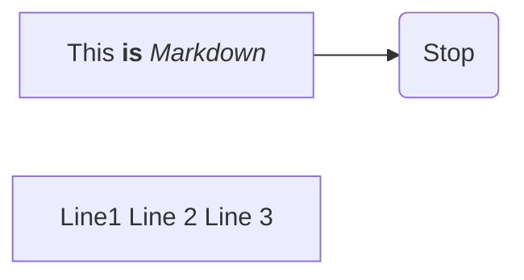
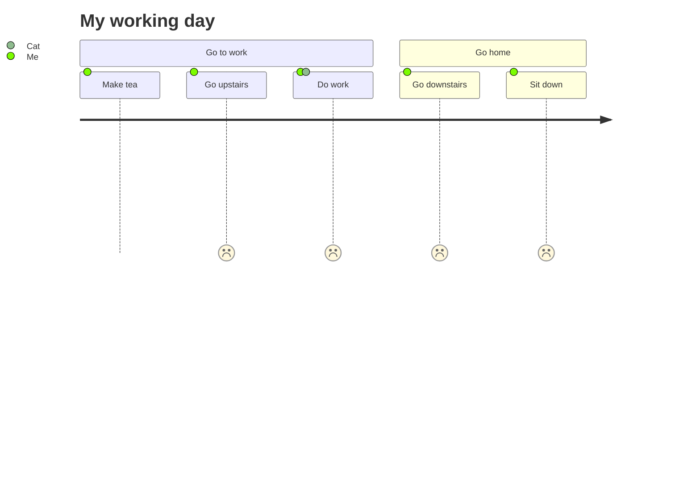

<p align="center">
  
  [:es: Español](#como-desplegar-tu-pipeline-de-análisis-usando-aspire) • [:uk: English](#how-to-deploy-your-analysis-pipeline-using-aspire) 
  
</p>


# Como desplegar los análisis de tu proyecto de investigación usando ASPIRE

 [Estructura del repositorio de código](#estructura-del-repositorio-de-código) • [Gestión de dependencias](#gestión-de-dependencias) • [Personalización](#personalización) • [Despliegue](#despliegue-del-pipeline-de-análisis) • [Como usar ASPIRE](#como-usar-aspire)

Bienvenido al tutorial para aprender a desplegar los análisis de tu proyecto de investigación configurado a partir del uso de la librería Common Data Model Builder ('cdmb') usando ASPIRE (Analytic Software Pipeline Interface for Reproducible Execution). 






- [ ] 1. Crea tu modelo común de datos usando la librería [cdmb](https://github.com/cienciadedatosysalud/cdmb).
- [ ] 2. Implementa tus scripts de análisis en R o Python en la estructura de trabaja que se obtiene del [cdmb](https://github.com/cienciadedatosysalud/cdmb).
- [ ] 3. Realiza el testeo adecuado de tus scripts con dato sintético.
- [ ] 4. Sigue este tutorial :blush:

Más información de las herramientas utilizadas:
<p align="left">
<a href="https://github.com/cienciadedatosysalud/aspire"></a>
<a href="https://github.com/cienciadedatosysalud/cdmb"></a>
</p>

Una vez hayas completado los tres primeros pasos podemos empezar con el tutorial.

## Estructura del repositorio de código

Para poder empaquetar nuestro pipeline de análisis es necesario partir de una estructura de proyecto estandarizada. En concreto, este tutorial se basa en la integración de la estructura de proyecto del modelo común de datos generada a partir de la utilización de la librería Common Data Model Builder (cdmb) y elementos auxiliares que nos ayudaran a instalar las dependencias necesarias de nuestro código de análisis y el empaquetamiento usando ASPIRE.

Obteniendo una estructura de proyecto como la siguiente:


> [!TIP]
> Puedes utilizar este repositorio como plantilla en el despliegue de tu pipeline de análisis. Para más información, visite [Crear un repositorio desde una plantilla](https://docs.github.com/es/repositories/creating-and-managing-repositories/creating-a-repository-from-a-template)

> [!IMPORTANT]  
> Revisa tu fichero `.gitignore`, asegúrate que no se publica ningún dato sensible utilizado en el desarrollo de los análisis en el repositorio.


## Gestión de dependencias

En este apartado trabajaremos los elementos que se encargan de instalar las dependencias (i.e., paquetes y/o librerías) requeridas por tus análisis.

ASPIRE usa [Micromamba](https://mamba.readthedocs.io/en/latest/user_guide/micromamba.html) para la gestión de dependencias de librerías y paquetes. Micromamba es una versión ligera y rápida de Mamba, un gestor de paquetes y entornos para Python y otros lenguajes.

La imagen base de ASPIRE (contenedor Docker) tiene instalado por defecto el siguiente conjunto de tecnologías/programas (más información, enlace al README con lo instalado).

- Python
- R
- Quarto
- Librerias/paquetes:
<table>
<tr><td>

| Software  | librería/paquete |
| ------------- | ------------- |
| Python  | fastapi  |
| Python  | chardet  |
| Python  | starlette  |
| Python  | urllib3  |
| Python  | uvicorn  |
| Python  | ydata-profiling  |
| Python  | python-multipart  |
| Python  | pandas  |
| Python  | duckdb  |
| &nbsp;  |   |
| &nbsp;  |   |
| &nbsp;  |   |
| &nbsp;  |   |
| &nbsp;  |   |

</td><td>

| Software  | librería/paquete |
| ------------- | ------------- |
| R  | base  |
| R  | knitr  |
| R  | rmarkdown  |
| R  | urllib3  |
| R  | uvicorn  |
| R  | logger  |
| R  | kableextra |
| R  | dbi  |
| R  | dplyr  |
| R  | purrr  |
| R  | remotes  |
| R  | rjson  |
| R  | hmisc  |
| R  | duckdb  |

</td>

</tr> </table>

Todas las dependencias de ASPIRE están instaladas en el entorno (environment) denominado **aspire**.

<!--En este punto - Qué punto es este? Explícalo... Una vez configurado un proyecto utilizando la librería cdmb necesitarás actualizar--> es necesario actualizar el entorno **aspire** y añadir las dependencias restantes para poder ejecutar nuestros scripts de análisis. 

> [!TIP]
> Apunta durante el desarrollo del código de análisis todas las liberías/paquetes que has necesitado con sus correspondientes versiones y evita tener en el código dependencias que no se utilizan declaradas.

### Declaración de dependencias: fichero env_project.yaml

El fichero **env_project.yaml** es un fichero que sigue las especificaciones YAML de Conda.

Los archivos YAML de Conda son archivos que contienen la información necesaria para crear y reproducir un entorno de Conda, como el nombre, los canales, las dependencias y las variables de entorno. 

Los archivos YAML de Conda tienen una estructura simple y legible, donde cada elemento se separa por dos puntos (:) o por guiones (-). 

> [!NOTE]  
> Un canal es una estructura de repositorios independiente y aislada que se utiliza para clasificar y administrar más fácilmente un servidor de paquetes. (más [información](https://mamba.readthedocs.io/en/latest/advanced_usage/more_concepts.html))

Cambia el ejemplo proporcionado por las librerías necesarias para el análisis y disponibles en los canales declarado (channels). Por ejemplo, el siguiente archivo YAML actualiza el entorno llamado aspire usando el canal [conda-forge](https://conda-forge.org/) con pandas versión 2.1.0, el paquete plotly de R versión 4.10.2, etc. 


``` yaml
name: aspire
channels:
 - conda-forge
dependencies:
- r-sf=1.0_14
- r-sjmisc=2.8.9
- r-gt=0.9.0
- r-cowplot=1.1.1
- r-ggalluvial=0.12.5
- r-ggrepel=0.9.3
- r-ggplot2=3.4.2
- r-plotly=4.10.2
- r-htmlwidgets=1.6.2
- pip:
  - ydata-profiling==4.6.0
- pandas==2.1.0
```

<details>

<summary>Dockerfile</summary>

### You can add a header

You can add text within a collapsed section. 

You can add an image or a code block, too.

```dockerfile
   puts "Hello World"
```

</details>


### Instalación manual: fichero Dockerfile

Es posible que algún paquete/librería no se encuentre en ninguno de los canales utilizados por Micromamba y se tenga que instalar de forma manual dentro del fichero Dockerfile.

Para realizarlo, modifique el fichero Dockerfile y añada el fragmento de código para que se instale la librería en el entorno aspire.

```
micromamba run -n aspire Rscript -e "remotes::install_github('gadenbuie/epoxy')"
```

En este ejemplo, se instala desde GitHub la librería epoxy de R haciendo uso de la librería *remotes*. Ahora el fichero Dockerfile se debería ver de la siguiente manera:

```dockerfile
# Installing dependencies
RUN micromamba install -y -n aspire -f /tmp/env_project.yaml \
    && micromamba run -n aspire Rscript -e "remotes::install_github('gadenbuie/epoxy')" \ 
    && micromamba clean --all --yes \
    && rm -rf /opt/conda/conda-meta /tmp/env_project.yaml
```

> [!NOTE]  
> Un environment o entorno es un conjunto de paquetes y dependencias que se instalan en una ubicación específica y que se pueden activar o desactivar según se necesiten. (más [información](https://mamba.readthedocs.io/en/latest/user_guide/concepts.html))


> [!CAUTION]
> micromamba es posible que modifique el versionado de algunas librerias respecto a lo especificado para asegurar compatibilidades. Por favor, compruebe en local que todo funciona correctamente (Construcción de la imagen -> Despliegue -> Ejecución del pipeline de análisis).


## Personalización

### Añadir logo

### Cambiar hora del sistema


## Automatización del repositorio

### GitHub Actions


### Referenciar y citar contenido

https://docs.github.com/es/repositories/archiving-a-github-repository/referencing-and-citing-content

## Despliegue del pipeline de análisis

### Descarga la imagen pipeline
```console
myuser@:~$ whoami
foo
```


> [!NOTE]  
> Concepto release.

> [!TIP]
> Puedes copiar la estructura de este repositorio y añadir la salida obtenida de la Common Data Model Builder.

> [!IMPORTANT]  
> Crucial information necessary for users to succeed.

> [!WARNING]  
> Critical content demanding immediate user attention due to potential risks.

> [!CAUTION]
> Negative potential consequences of an action.


## Como usar ASPIRE

### Mapear input de entrada

### Ejecutar scripts de análisis

### Obtener outputs

### Referencias

# How to deploy your analysis pipeline using ASPIRE

[Code repository structure](#code-repository-structure) • [Dependency management](#dependency-management) • [Customization](#customization) • [Deployment](#deployment-of-the-analysis-pipeline) • [How to use ASPIRE](#how-to-use-aspire)

## Code repository structure

## Dependency management

## Customization

## Deployment of the analysis pipeline

## How to use ASPIRE


